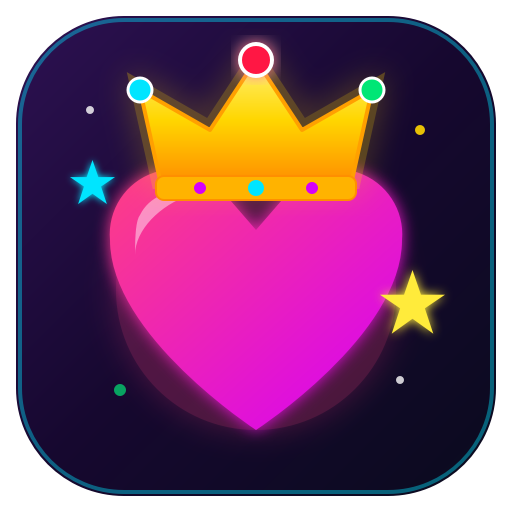

<div align="center">



# JimHa's Magical Key Smash Game 👑💖✨

**A toddler-safe, fullscreen interactive wonderland designed for tactile exploration.**

[](LICENSE)
[](PKGBUILD)
[](https://github.com/kuasha420/jimha)
[](https://github.com/kuasha420/knot-mesh)

</div>

---

## 📖 The Origin Story

**JimHa's Key Smash Game** was born during JimHa's very first **agentic pair programming session**. 

Sitting with a Steam Deck handheld running Arch Linux, her father gave a simple, loving challenge to an autonomous AI agent: create a magical visual playground for JimHa that reacts to any random keyboard smash with giant bouncing characters, colorful companion emojis, and soothing sounds — without letting curious little hands accidentally close the game.

Because the command originated from a handheld device, the entire prototype was orchestrated across the [**Knot Mesh**](https://github.com/kuasha420/knot-mesh) — projecting and running live in fullscreen on the Desktop PC monitor across the room in real time.

Today, **JimHa** is packaged as a standalone, production-ready desktop game for all Linux users, while proudly preserving its Knot Mesh multi-device origin.

---

## ✨ Features

- **🎮 Giant Responsive Key Animations**: Every key press triggers massive typography scaling with elastic spring physics, radiant glowing halos, and vibrant pastel-neon palettes.
- **🦄 Alphabet & Companion Emojis**:
  - **`J`**: 👑 **JimHa!** ✨
  - **`H`**: 💖 **Jim Heart (Easter Egg!)** 💖
  - **`A`–`Z`**: 🍎 Apple, 🦋 Butterfly, 🐱 Cat, 🐶 Dog, 🐘 Elephant, 🌸 Flower, 🎸 Guitar...
  - **`0`–`9`**: Huge digits accompanied by that exact number of glittering stars.
  - **`Space`**: 🌟 Cosmic supernova fireworks!
  - **`Enter`**: 🎉 Party celebration balloons and confetti!
  - **`Backspace`**: 🫧 Bubble pop flurry!
  - **`Arrow Keys`**: 🚀 Directional zoom and dive effects!
- **🫧 Touch & Mouse Interaction**: Tapping the screen or clicking spawns floating, translucent bubbles that rise and can be popped.
- **🎵 Soothing Pentatonic Chimes**: Built-in sound synthesis engine (using Python standard library `wave` and `math` with zero external audio dependencies). Plays celestial celesta/bell notes across an 11-tone pentatonic scale (C4–C6). Rapid smashing sounds like a melodious wind chime, never dissonant.
- **🛡️ Toddler-Safe Exit Protection (3-Second ESC Hold)**: Accidental hits on `Escape` will **not** close the game. To exit, a parent must hold `Escape` continuously for 3.0 seconds. A circular HUD countdown overlay displays progress and immediately cancels if released early.
- **⚡ Wayland & Hardware Accelerated**: Built on PyQt6 with native Wayland support (`QT_QPA_PLATFORM=wayland`) and intelligent idle framerate scaling (60 FPS active, 30 FPS resting) to preserve battery and GPU cycles.

---

## 📦 Installation

### Arch Linux / SteamOS (Desktop Mode)

You can build and install using the included `PKGBUILD`:

```bash
# Clone the repository
git clone https://github.com/kuasha420/jimha.git
cd jimha

# Build and install package
makepkg -si
```

This installs:
- Binary: `/usr/bin/jimha`
- Desktop Entry: `/usr/share/applications/jimha.desktop` (visible in KDE/GNOME/Steam application menus)
- App Icon: `/usr/share/icons/hicolor/scalable/apps/jimha.svg` and `512x512/apps/jimha.png`

### Standard Python / Manual Installation

```bash
# Clone the repository
git clone https://github.com/kuasha420/jimha.git
cd jimha

# Install dependencies
pip install PyQt6

# Install locally
pip install .
```

---

## 🚀 Usage

### Run from App Menu
Look for **JimHa's Key Smash** in your desktop application launcher under **Games**.

### Run from Terminal

```bash
# Launch in Fullscreen (Default)
jimha

# Launch in Windowed mode (for debugging)
jimha --windowed

# Launch with sound muted
jimha --no-audio
```

### 🪢 Knot Mesh Remote Launch

If you run the [Knot Mesh](https://github.com/kuasha420/knot-mesh) multi-device fabric across your home:

```bash
# Launch remotely on Desktop PC from Steam Deck or Laptop
jimha --mesh-target desktop
```

---

## 🧪 Testing

Run the automated test suite in headless mode:

```bash
QT_QPA_PLATFORM=offscreen python3 -m unittest discover -s tests
```

---

## 📄 License

Released under the [MIT License](LICENSE). Dedicated with love to JimHa. 💖
